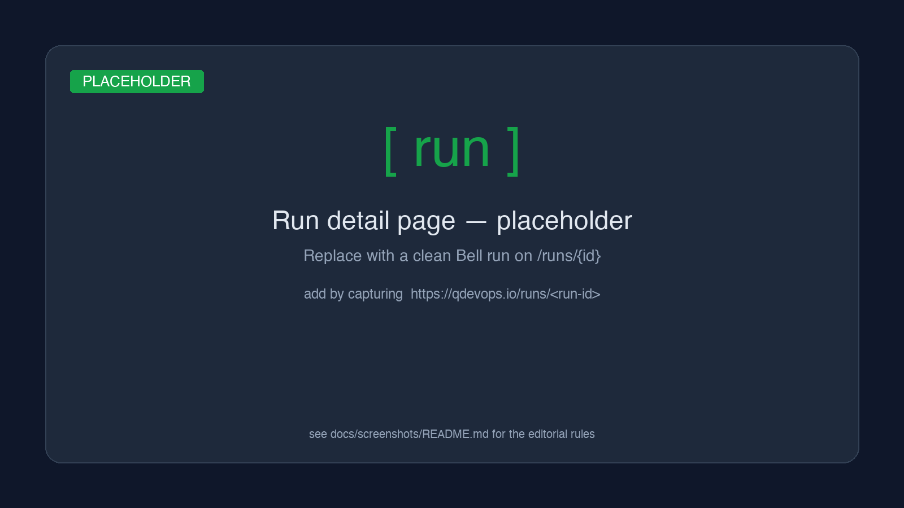
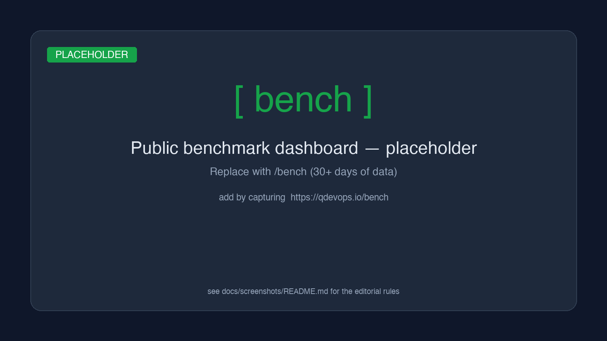

<h1 align="center">qdevops Python SDK</h1>

<p align="center">
  <strong>Submit, monitor, and reproduce quantum circuit runs from a script, a notebook, or CI.</strong>
</p>

<p align="center">
  <a href="https://pypi.org/project/qdevops-io/"></a>
  <a href="https://pypi.org/project/qdevops-io/"></a>
  <a href="https://pypi.org/project/qdevops-io/"></a>
  <a href="./LICENSE"></a>
  <a href="https://github.com/qdevops-io/bell-example/actions/workflows/run.yml"></a>
  <a href="https://qdevops.io/bench"></a>
</p>

<p align="center">
  <a href="#quickstart">Quickstart</a> ·
  <a href="#examples">Examples</a> ·
  <a href="#architecture">Architecture</a> ·
  <a href="./ROADMAP.md">Roadmap</a> ·
  <a href="https://qdevops.io">qdevops.io</a>
</p>

---

## Why

Running a quantum circuit shouldn't be 200 lines of vendor-specific boilerplate.
With `qdevops` it's three:

```python
from qdevops import Client

client = Client(api_token="qass_pat_...")
submission = client.submit_run(project_id=42, circuit="bell", backend="simulator", params={"shots": 4096})
result = client.wait_for_run(submission.run_id).result
print(result["counts"])  # {'00': 2031, '11': 2065}
```

The SDK talks to `api.qdevops.io`, which queues your job, runs it on the backend
you asked for (simulator, IBM Quantum, AWS Braket), records duration and queue
wait, and gives you back a structured result. Every run is reproducible by ID,
visible on a [public benchmark dashboard](https://qdevops.io/bench), and pinnable
to a locked environment so a result from today is bit-for-bit reproducible next year.

## Install

```bash
pip install qdevops-io
```

Requires Python 3.10+. No quantum SDK dependencies — `qdevops-io` is a pure-Python
HTTP client. The heavy lifting (Qiskit, Braket, cuQuantum, …) lives on the
server side.

## Quickstart

1. **Get a token** at [qdevops.io/account/tokens](https://qdevops.io/account/tokens)
   with the `runs:rw` scope.
2. **Note your project id** from [qdevops.io/projects](https://qdevops.io/projects).
3. **Run the Bell-pair example:**

```python
import os
from qdevops import APIError, Client

client = Client(api_token=os.environ["QDEVOPS_API_TOKEN"])

submission = client.submit_run(
    project_id=int(os.environ["QDEVOPS_PROJECT_ID"]),
    circuit="bell",
    backend="simulator",
    params={"shots": 4096},
)

run = client.wait_for_run(submission.run_id, timeout=300, poll_interval=2)

if run.status != "succeeded":
    raise RuntimeError(f"run failed: {run.failure_reason}")

counts = run.result["counts"]
good = counts.get("00", 0) + counts.get("11", 0)
fidelity = good / sum(counts.values())

print(f"counts   = {counts}")
print(f"fidelity = {fidelity:.4f}")
print(f"duration = {run.duration_ms} ms")
```

```text
counts   = {'00': 2031, '11': 2065}
fidelity = 1.0000
duration = 42 ms
```

A copy of this lives in [`examples/quickstart.py`](./examples/quickstart.py).

## Examples

Six standalone repos, each ~50 lines of substance, each with green CI that
proves the SDK→API→worker→backend path is healthy end-to-end:

| Repo                                                                         | Demonstrates                                                                  |
| ---------------------------------------------------------------------------- | ----------------------------------------------------------------------------- |
| [bell-example](https://github.com/qdevops-io/bell-example)                   | Two-qubit Bell state — minimal entanglement, the "Hello World"                |
| [ghz-example](https://github.com/qdevops-io/ghz-example)                     | Multi-qubit GHZ state — `params: {nQubits: n}` parameterised submission       |
| [vqe-example](https://github.com/qdevops-io/vqe-example)                     | Variational quantum eigensolver — iterative circuits, convergence scoring    |
| [compare-example](https://github.com/qdevops-io/compare-example)             | `mode=compare` — side-by-side `standard` vs `zne` error mitigation diff       |
| [reproducibility-example](https://github.com/qdevops-io/reproducibility-example) | `env_id` pinning — same recipe today, same counts in twelve months         |
| [rerun-example](https://github.com/qdevops-io/rerun-example)                 | Re-executing a previous run from its recorded artifacts                       |

Every example's CI runs against the real platform on every push. If any badge
on the [`qdevops-io` org](https://github.com/qdevops-io) goes red, something is
broken end-to-end. Infrastructure trust comes from examples.

## Architecture

```mermaid
flowchart LR
  subgraph Caller["Your code"]
    direction TB
    Script["script / notebook / CI"]
    SDK["qdevops<br/>Python SDK"]
    Script --> SDK
  end

  SDK -->|HTTPS<br/>Bearer PAT| API["api.qdevops.io<br/>(public REST API)"]
  API -->|enqueue| Q[("per-env SQS queue")]
  Q --> W["worker<br/>(Python on Fargate)"]

  W --> SIM["simulator"]
  W -->|user creds| IBM["IBM Quantum"]
  W -->|user creds| BRK["AWS Braket"]

  SIM -.->|counts + metrics| W
  IBM -.->|counts + metrics| W
  BRK -.->|counts + metrics| W

  W -->|persist result| API
  API -.->|/api/runs/{id}/status| SDK
  API --> DASH["qdevops.io/bench<br/>(public dashboard)"]

  classDef yours fill:#e8f1ff,stroke:#3b82f6,stroke-width:2px,color:#1e3a8a;
  classDef ours fill:#f0fdf4,stroke:#16a34a,stroke-width:2px,color:#14532d;
  classDef theirs fill:#fef3c7,stroke:#d97706,stroke-width:2px,color:#92400e;
  class Script,SDK yours;
  class API,Q,W,SIM,DASH ours;
  class IBM,BRK theirs;
```

Three properties this architecture buys you:

- **No vendor lock-in.** The SDK talks one protocol; backends are swappable by
  changing one string. Your IBM credentials never leave your account — the
  worker proxies them.
- **Every run is forensic.** Run id, circuit hash, backend, duration, queue
  wait, environment fingerprint, and full result are all persisted. Send anyone
  a run id and they can audit it.
- **CI-native.** The SDK is a pure-Python HTTP client. No native deps, no GPU
  required to call it, no Qiskit version conflicts in your container.

A deeper architecture walk-through lives in [`docs/architecture.md`](./docs/architecture.md).

## Screenshots

<!-- See docs/screenshots/README.md for which images to add and where to source them. -->

| Run detail page                        | Public benchmark dashboard                |
| -------------------------------------- | ----------------------------------------- |
|  |  |

## Configuration

| Variable               | Default                | Meaning                                                                |
| ---------------------- | ---------------------- | ---------------------------------------------------------------------- |
| `QDEVOPS_API_TOKEN`    | _(required)_           | Personal access token (`runs:rw` scope minimum)                        |
| `QDEVOPS_PROJECT_ID`   | _(per-call)_           | Project the run belongs to                                             |
| `QDEVOPS_BASE_URL`     | `https://qdevops.io`   | Override for self-hosted / staging                                     |

The `Client` constructor takes the token and base URL directly if you'd rather
not use env vars:

```python
Client(api_token="qass_pat_…", base_url="https://qdevops.io")
```

## Roadmap

See [ROADMAP.md](./ROADMAP.md) for the full proposal. Highlights:

- [ ] `asyncio` client (`AsyncClient`) for fan-out workloads
- [ ] `qdevops` CLI — `qdevops run bell --backend simulator --shots 4096`
- [ ] First-class TypeScript SDK
- [ ] Webhook callbacks (replace polling)
- [ ] Pulse-level access for advanced users
- [ ] Streaming intermediate VQE iterates

## Contributing

Issues and PRs welcome. The example repos under [`qdevops-io`](https://github.com/qdevops-io)
are the easiest place to contribute — adding a circuit, a new backend, or a
benchmark methodology is a great first PR.

## License

Apache-2.0 — see [LICENSE](./LICENSE).
