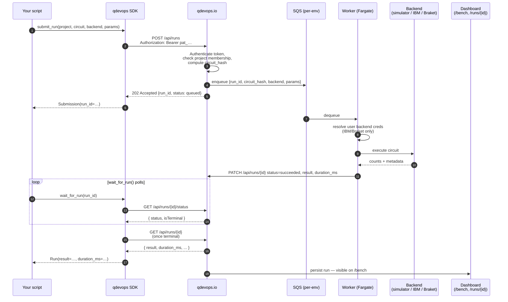
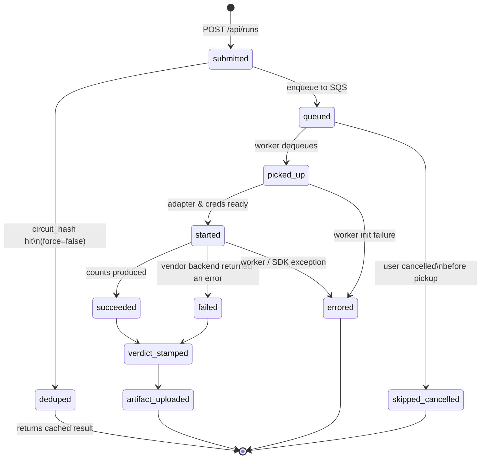
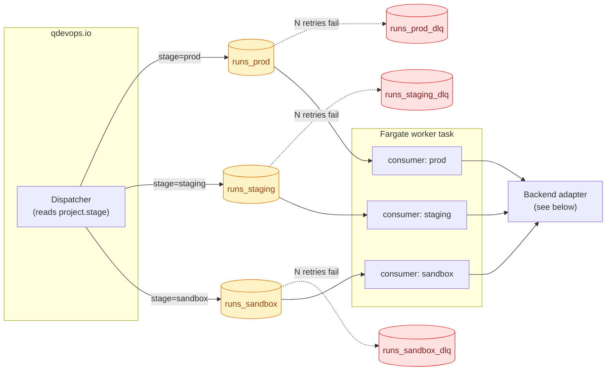
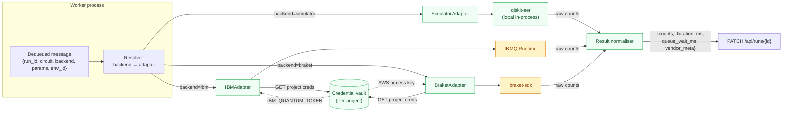
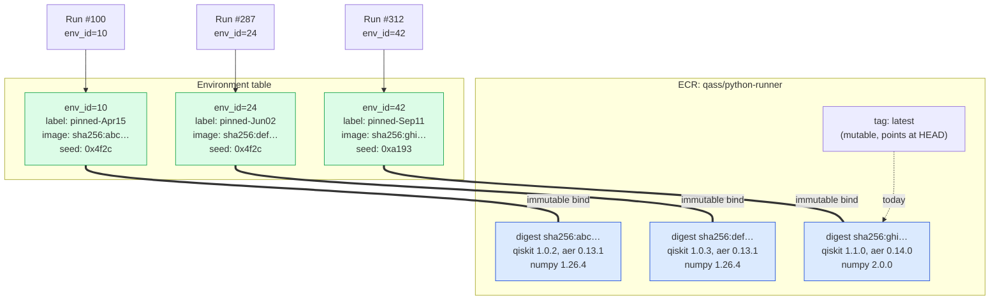
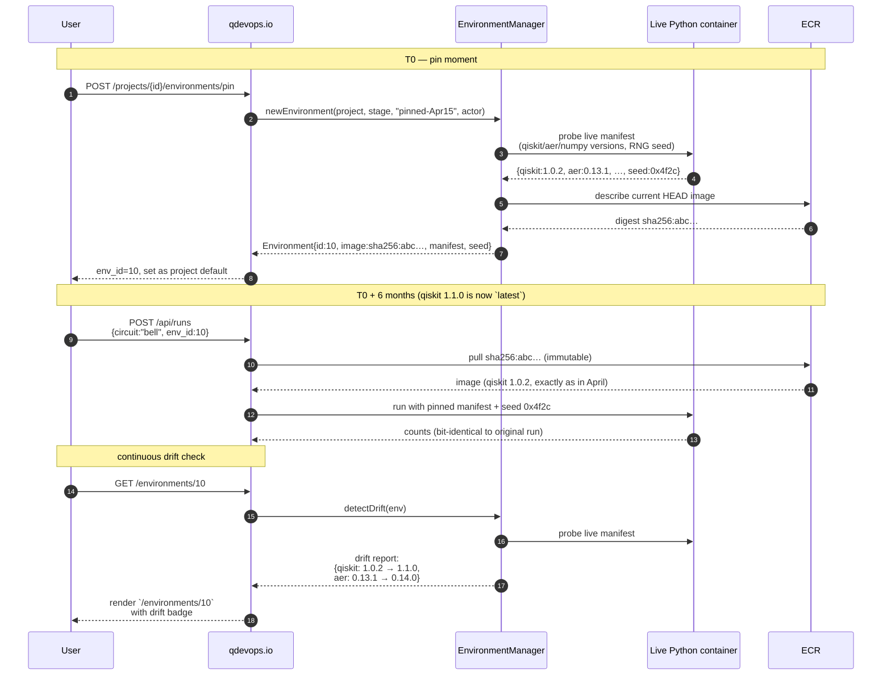
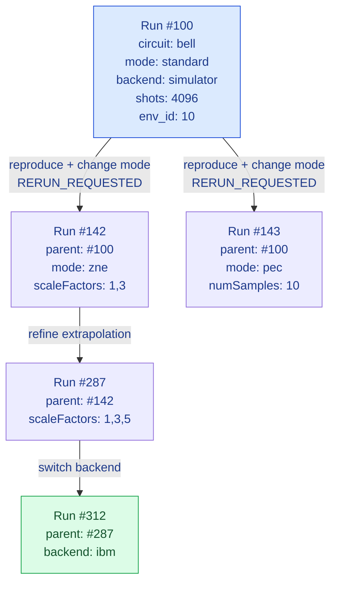

# Architecture

This is a deeper walk-through of how a `client.submit_run(...)` call
becomes a real result on a quantum backend. If you only care about the
ten-second version, the diagram at the top of the [README](../README.md)
is enough.

> Every Mermaid diagram below is also exported as PNG + SVG in the
> [diagram gallery](./diagrams/) for slides, blog posts, and Markdown
> viewers that can't render Mermaid inline.

## Contents

1. [End-to-end flow](#end-to-end-flow) — request to result, as a sequence
2. [Execution flow](#execution-flow) — every state a run can be in
3. [SQS orchestration](#sqs-orchestration) — three queues, per-stage routing
4. [Backend adapter flow](#backend-adapter-flow) — how a backend string becomes a vendor call
5. [ECR image pinning](#ecr-image-pinning) — why digests, not tags
6. [Reproducibility lifecycle](#reproducibility-lifecycle) — pinning a recipe in time
7. [Rerun lineage](#rerun-lineage) — `parent_run_id` and the run-tree
8. [Components](#components) — what each box owns
9. [What the SDK guarantees](#what-the-sdk-guarantees-and-what-it-doesnt) — and what it doesn't

## End-to-end flow

## Execution flow

Every run is an append-only timeline of typed events backed by the
`RunEvent` table (one row per state transition, queryable per-run on
`/runs/{id}`). This is what the actual state machine looks like —
straight from the `RunEvent::KIND_*` constants on the platform side:

A few non-obvious points worth calling out:

- **`deduped`** is a terminal state. With `force=false` (default), a
  resubmission whose circuit-hash matches a previous run short-circuits
  to the cached result without re-executing on the worker. Benchmark
  scripts always pass `force=true` because the queue-wait/duration
  metrics would otherwise be meaningless.
- **`verdict_stamped`** runs on both `succeeded` and `failed` because
  failure modes themselves are signal — they get a verdict too.
- **`errored`** vs **`failed`**: `failed` means the backend ran the
  circuit and reported an error condition (e.g. depolarising noise
  beyond threshold). `errored` means the worker/SDK itself crashed
  before producing a backend result. The dashboard treats them
  differently.

## SQS orchestration

The platform runs three production stages — `prod`, `staging`,
`sandbox` — each with its own SQS queue and its own worker consumer.
The dispatcher routes by `project.stage`, never by a query parameter,
so a sandbox project can never accidentally book a prod queue slot.

- **One Fargate task, three consumers.** A single long-lived ECS task
  runs three Messenger consumer loops (`messenger:consume runs_prod
  runs_staging runs_sandbox`). One task is cheaper than three and a
  noisy stage can't starve the others — the loops have separate retry
  budgets.
- **DLQs are first-class.** An operator can replay a DLQ message
  (`KIND_REDISPATCHED` on the run timeline) without losing the
  original event trail.
- **No cross-stage routing.** A run can never move between stages —
  if you need to "promote" a sandbox recipe to prod, you submit a new
  run with the same `env_id` in the prod project.

## Backend adapter flow

The worker turns a backend string into a vendor SDK call through an
adapter layer. Adapters share one interface (`run(circuit, params) ->
counts + metadata`) but differ in credential handling and result
normalisation.

- **Credentials never leave the worker.** The SDK doesn't ship your IBM
  token to `qdevops.io` — the platform stores it encrypted in the
  vault and the worker pulls it just-in-time per run. Logs scrub the
  token before persistence (`EnvScrubDigestsCommand` handles cleanup).
- **One result schema, many backends.** The normaliser is what makes
  `run.result["counts"]` portable across vendors. Vendor-specific
  metadata lands under `run.result["vendor_meta"]` for users who need
  it.
- **Adding a new backend is one adapter class.** No SDK change, no API
  schema change, no client redeploy.

## ECR image pinning

The unit of reproducibility is the **ECR image digest**, not a tag.
Tags are mutable (`latest` drifts every push), digests are content-
addressed and immutable forever. Every `Environment` row stores a
digest, never a tag.

- **`latest` is a moving target.** It's fine for the live container
  drift probe (`EnvironmentManager::detectDrift`), but no `Run` is ever
  resolved against a tag — only a digest.
- **Cleanup is digest-aware.** `EnvScrubDigestsCommand` checks the live
  `Environment` table before evicting a digest from ECR, so an old env
  that's still referenced never gets reaped.

## Reproducibility lifecycle

How "pinning" actually works from the user's perspective, end-to-end:

- **Pin = snapshot, not policy.** Pinning copies the live container's
  state into a row; the live container keeps moving. That's why the
  `Environment.show` page renders a drift report — it tells you how
  far the world has moved since you pinned.
- **Default-env auto-pinning.** `EnvironmentManager::ensureDefault`
  guarantees every project has at least one env, so a user who never
  visits `/environments` still gets reproducible runs on a sensible
  default.
- **RNG seed travels with the env.** Reproducing a result on
  `backend=simulator` requires the same seed; the platform stores it
  alongside the digest so "same env_id" really does mean "same bits".

## Rerun lineage

Every "reproduce" or "modify and resubmit" creates a *new* run with a
`parent_run_id` pointing at the source. `RunLineageService` walks the
chain and renders a per-dimension diff on `/runs/{id}/lineage`.

`RunLineageService::diff(parent, child)` emits one row per dimension
(circuit / mitigation / execution) with `status: same | changed`, so the
UI can render the diff like a `git diff` of run parameters. Concrete
example for `#100 → #142`:

| Dimension   | Field         | Status   | From       | To         |
| ----------- | ------------- | -------- | ---------- | ---------- |
| Circuit     | Circuit type  | same     | Bell (Φ⁺)  | Bell (Φ⁺)  |
| Mitigation  | Mode          | changed  | standard   | zne        |
| Mitigation  | Strategy      | changed  | none       | —          |
| Mitigation  | Extrapolation | changed  | —          | linear     |
| Mitigation  | Scale factors | changed  | —          | 1,3        |
| Execution   | Backend       | same     | simulator  | simulator  |
| Execution   | Shots         | same     | 4096       | 4096       |

A run's `RunEvent` timeline records `KIND_RERUN_REQUESTED` on the
parent side (audit) and `KIND_SUBMITTED` on the child side (intake), so
the lineage is reconstructable from events alone if the FK is ever
lost.

## Components

### 1. SDK (this repo, eventually)

A pure-Python HTTP client. No quantum dependencies. Responsible for:

- Authentication (Bearer PAT or session cookie when called from a
  notebook on `qdevops.io`).
- Request shaping (the JSON body for `POST /api/runs`).
- Polling loop in `wait_for_run` (with exponential-ish backoff, capped
  at `poll_interval`).
- Mapping `APIError` from HTTP non-2xx responses, with `.status_code`,
  `.message`, and `.body` accessible.

The SDK explicitly does **not** simulate locally. The whole point of
having a server-side simulator backend is that a result you got today
can be reproduced byte-for-byte tomorrow regardless of your laptop.

### 2. Public API (`qdevops.io`, canonical `api.qdevops.io`)

Symfony / PHP, served on the same hosts as the marketing site (the
nginx config terminates both `qdevops.io` and `api.qdevops.io` — once
the latter's CNAME is in DNS, both hostnames will serve the same
routes; the SDK's `QDEVOPS_BASE_URL` default of `https://qdevops.io`
will continue working unchanged).

Responsible for:

- AuthN / AuthZ — token scopes, project membership, rate limits.
- Circuit hashing (so identical submissions can be deduplicated unless
  `force=True`).
- Enqueueing to the right per-environment SQS queue (`prod`,
  `staging`, `sandbox`).
- Persisting `BenchmarkRun` rows when `POST /api/benchmarks` is called
  with the `benchmarks:write` scope.

OpenAPI spec is the source of truth — see [`config/openapi/platform.yaml`](https://github.com/qdevops-io/qass)
in the platform repo.

### 3. Worker (Python on Fargate)

Long-lived ECS task consuming SQS. Responsible for:

- Fetching the user's backend credentials from the vault (IBM token,
  Braket key — never logged, never exposed back to the API).
- Translating the high-level `circuit` family + `params` into the
  vendor SDK's call (Qiskit / Braket / cuQuantum).
- Measuring `duration_ms` from start of execution to completion (does
  not include queue wait — that's computed by the API).
- Reporting the result back via `PATCH /api/runs/{id}`.

### 4. Backends

- **`simulator`** — server-side Qiskit Aer / NumPy / cuQuantum. No
  external credentials needed. Deterministic seedable.
- **`ibm`** — IBM Quantum. Routed through the user's `IBM_QUANTUM_TOKEN`.
  Queue wait is real and reported as `queue_wait_ms`.
- **`braket`** — AWS Braket. Routed through the user's AWS credentials.

### 5. Dashboard

The publishing side of the platform: `/bench` for the public benchmark
ledger, `/runs/{id}` for per-run forensics, project pages for team
visibility.

## What the SDK guarantees (and what it doesn't)

**Guarantees:**

- A `Run` whose `status == "succeeded"` has a non-`None` `result`.
- Every error path from `submit_run` is an `APIError` with structured
  fields, never a bare `requests.exceptions.HTTPError`.
- `wait_for_run` returns on terminal status or raises a timeout —
  never returns a still-running run.
- All datetime fields are ISO-8601 with explicit timezone.

**Does not guarantee:**

- That `result["counts"]` has any particular keys. Different circuit
  families produce different result shapes; consult the per-circuit
  docs.
- Bit-exact reproducibility across `env_id` changes. Pin `env_id` for
  reproducibility — see [reproducibility-example](https://github.com/qdevops-io/reproducibility-example).
- Idempotency on `submit_run`. Use `force=False` (the default) to lean
  on circuit-hash dedup, or supply your own idempotency key in
  `params["idempotency_key"]`.

## See also

- [bell-example](https://github.com/qdevops-io/bell-example) — the
  simplest possible end-to-end run.
- [Platform OpenAPI](https://github.com/qdevops-io/qass) — the
  authoritative API surface.
- [ROADMAP](../ROADMAP.md) — where this SDK is going.
