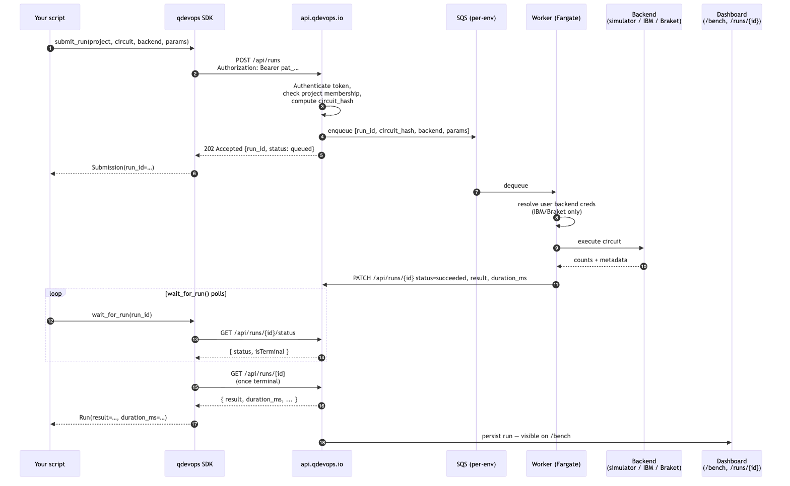
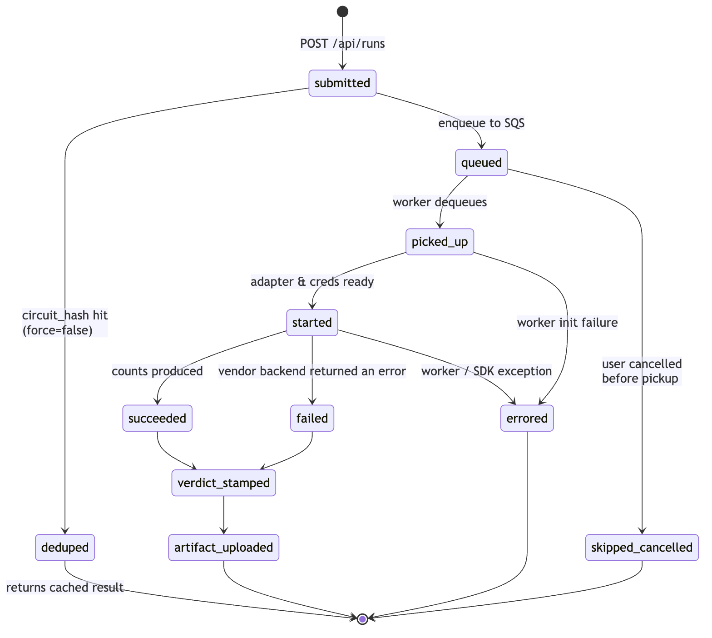
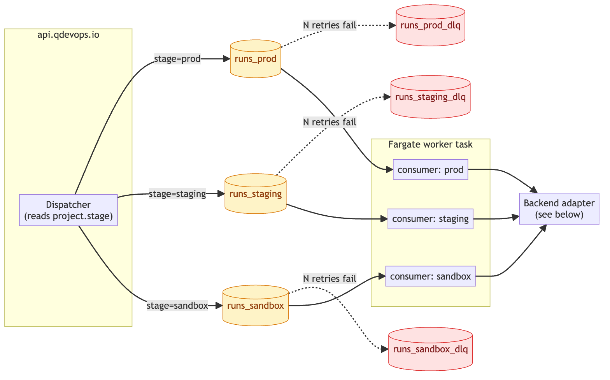
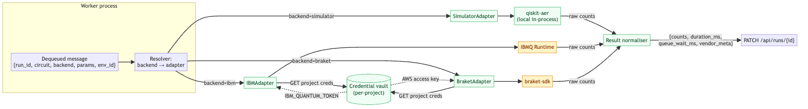
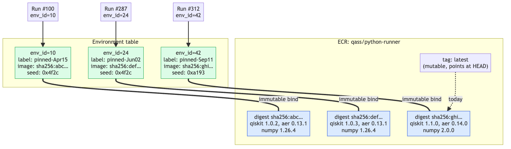
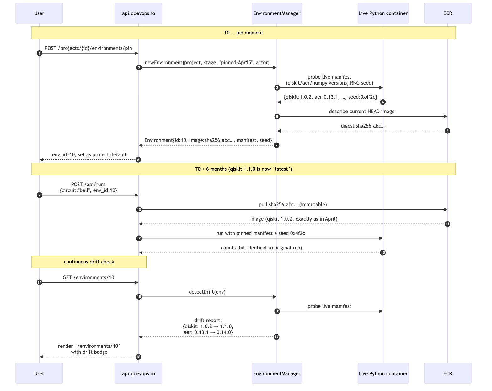
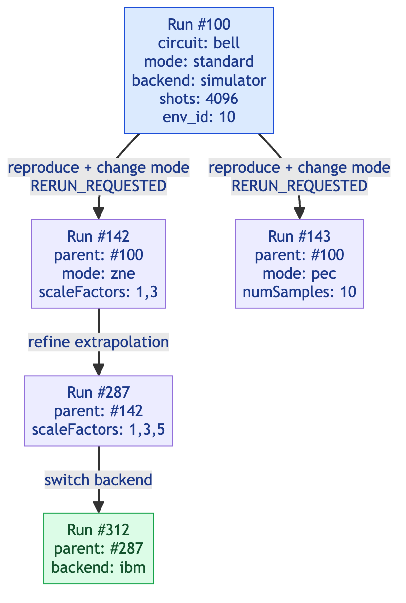

# Diagram gallery

All seven architecture diagrams from [`docs/architecture.md`](../architecture.md),
exported as raster (PNG, 2× scale, ~50–130 KB) and vector (SVG, ~10–35 KB)
for use in slides, blog posts, social cards, or any Markdown viewer that
doesn't render Mermaid.

The Mermaid source for each diagram lives next to the export (`*.mmd`)
so anyone can re-render or modify them with `mmdc` (see
[Regenerating](#regenerating) below).

## End-to-end flow

A `client.submit_run(...)` from the SDK to a persisted result on the
dashboard, as a sequence diagram.



Sources: [`00_end_to_end.mmd`](./00_end_to_end.mmd) · [SVG](./00_end_to_end.svg)

## Execution flow

The full state machine a run moves through, drawn straight from the
platform's `RunEvent::KIND_*` constants. Note `deduped` and
`skipped_cancelled` are terminal states; `errored` vs `failed` is the
worker-crashed vs backend-rejected distinction.



Sources: [`01_execution_flow.mmd`](./01_execution_flow.mmd) · [SVG](./01_execution_flow.svg)

## SQS orchestration

Three queues (prod / staging / sandbox), three consumers on one Fargate
task, three DLQs. The dispatcher routes by `project.stage` — never by
query parameter — so cross-stage routing is impossible by design.



Sources: [`02_sqs_orchestration.mmd`](./02_sqs_orchestration.mmd) · [SVG](./02_sqs_orchestration.svg)

## Backend adapter flow

How a backend string becomes a vendor SDK call. Credentials are
fetched from the per-project vault on the worker side; they never
transit `api.qdevops.io` and never enter logs. One result normaliser
unifies vendor outputs under a single schema.



Sources: [`03_backend_adapter.mmd`](./03_backend_adapter.mmd) · [SVG](./03_backend_adapter.svg)

## ECR image pinning

The unit of reproducibility is the ECR image **digest**, not a tag.
`latest` is a moving target; digests are content-addressed and
immutable forever. Every `Environment` row stores a digest.



Sources: [`04_ecr_pinning.mmd`](./04_ecr_pinning.mmd) · [SVG](./04_ecr_pinning.svg)

## Reproducibility lifecycle

What happens when a user pins an environment from the live container,
and how a run six months later still produces bit-identical counts.



Sources: [`05_reproducibility_lifecycle.mmd`](./05_reproducibility_lifecycle.mmd) · [SVG](./05_reproducibility_lifecycle.svg)

## Rerun lineage

Every "reproduce" creates a new run with `parent_run_id` pointing at
the source. `RunLineageService` walks the chain and emits a structured
per-dimension diff (circuit / mitigation / execution).



Sources: [`06_rerun_lineage.mmd`](./06_rerun_lineage.mmd) · [SVG](./06_rerun_lineage.svg)

---

## Regenerating

The Mermaid source in [`docs/architecture.md`](../architecture.md) is
the source of truth. After editing a diagram there, regenerate the
exports with:

```bash
# Install mermaid-cli and Chrome-for-testing once.
npx puppeteer browsers install chrome

# Extract every ```mermaid block to a .mmd file in this folder.
python3 - <<'PY'
import re, pathlib
md = pathlib.Path("docs/architecture.md").read_text()
blocks = re.findall(r"```mermaid\n(.*?)\n```", md, re.S)
names = [
    "00_end_to_end", "01_execution_flow", "02_sqs_orchestration",
    "03_backend_adapter", "04_ecr_pinning",
    "05_reproducibility_lifecycle", "06_rerun_lineage",
]
out = pathlib.Path("docs/diagrams")
for i, b in enumerate(blocks):
    (out / f"{names[i]}.mmd").write_text(b)
PY

# Render PNG (2× scale) and SVG for each.
for f in docs/diagrams/*.mmd; do
  npx -p @mermaid-js/mermaid-cli mmdc -i "$f" -o "${f%.mmd}.png" \
    --backgroundColor white --scale 2
  npx -p @mermaid-js/mermaid-cli mmdc -i "$f" -o "${f%.mmd}.svg" \
    --backgroundColor white
done
```

## Editorial rules

- **Mermaid source is the source of truth.** Don't hand-edit the PNG/SVG
  exports — they'll desync from `architecture.md` and we'll publish a
  lie. Always edit the Mermaid block, then regenerate.
- **No semicolons inside message labels** for `sequenceDiagram`.
  Mermaid treats `;` as a statement terminator and the export will
  fail — even if GitHub's renderer is lenient enough to render anyway.
- **PNG at 2× scale, white background.** Keeps text crisp on Retina /
  high-DPI screens and works in light- and dark-themed READMEs alike.
- **No proprietary fonts / colours.** Stick to the default Mermaid
  theme so anyone can re-render without setting up a theme config.
